# DBonK8s

>  A all-in-one tool for deploying different database with ease

## Motivation

The goal of this project is to provide a easy way for user to spin up a database for development or testing(mostly testing), it also provides  simple user management for admins.

## Overview

DBonK8s is a linebot running on kubernetes, user can interact with the bot to access and manage it's own databases(or others for admin).

## Features

* Spin up different types of database
* Configure database default username and password
* Manage databse and view its info

## Available Commands

* `config [-upt]` 
  * `short:"u" long:"username" description:"configure username"`
  * `short:"p" long:"password" description:"configure password"`
  * `short:"t" long:"token" description:"admin token"` (for admin)
* `list [-an]`
  *    `short:"a" long:"all" description:"list all namespace instance"` (for admin)
  *  `short:"n" long:"namespace" description:"database namespace"` (for admin)
* `info [-dn]`
  *  `short:"d" long:"dbname" description:"database name" required:"true"`
  *  `short:"n" long:"namespace" description:"database namespace"` (for admin)
* `stop [-dn]`
  *  `short:"d" long:"dbname" description:"database name" required:"true"`
  *  `short:"n" long:"namespace" description:"database namespace"` (for admin)
* `create [-dtn]`
  *  `short:"d" long:"dbname" description:"database name" required:"true"`
  *  `short:"t" long:"type" description:"database type" required:"true" choice:"postgres" choice:"mysql" choice:"redis" choice:"mongodb"`
  *  `short:"n" long:"namespace" description:"database namespace"` (for admin)
* `myinfo [-a]`
  *  `short:"a" long:"all" description:"list all user"`
* `fsm`
  * `description:"show fsm diagram"`

Global Flag `-h` : show the info for each command

## Deploy

### Prerequisite

* gcloud account
* terrafrom

### Enviroment setup

* setup a project in gcloud
* modify `project_id` and `region` in `terraform/terraform.tfvars`

### Deploy with terraform

```shell
terraform plan #check the result
```

```shell
terraform apply
```


## Example

### Configure Database default username and password

* type `config` along with your settings 

* type `myinfo` to confirm

  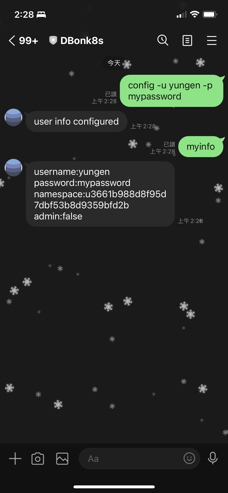

### Create a new database

* type `create` along with database name and database type

  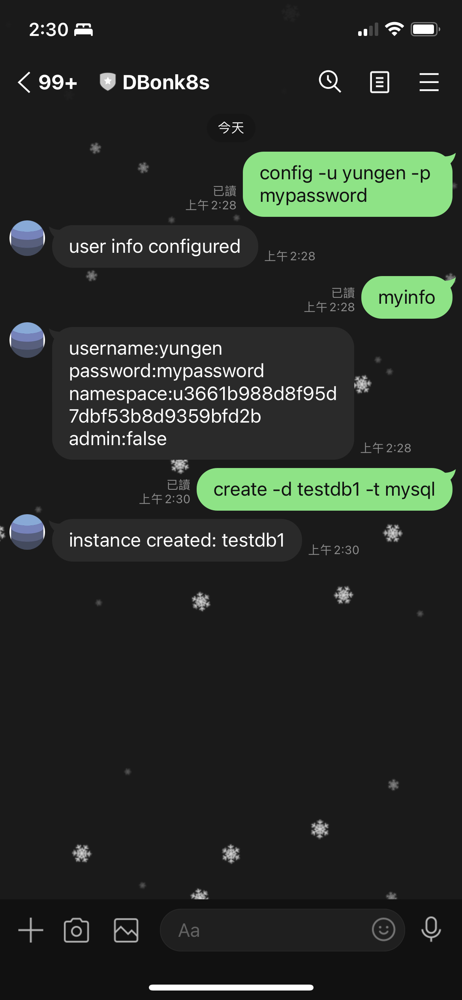

* type `list` to confirm

  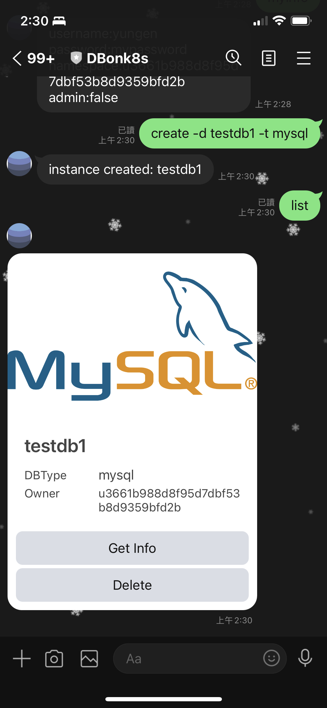

* you can create multiple instances (not limited to different database type)

  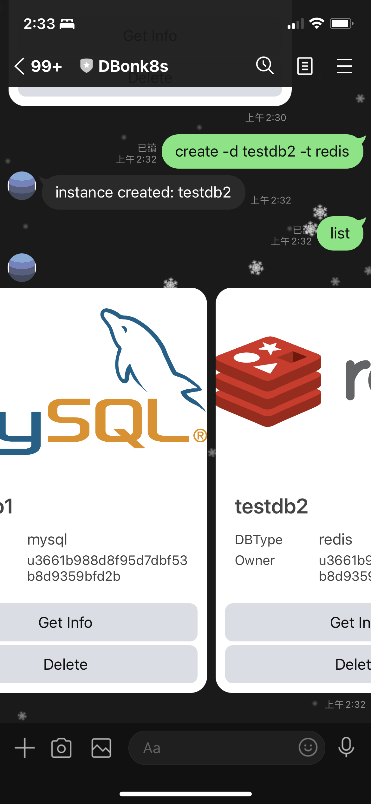

### Get Details of each instances

* click `Get Info` button in the carousel

  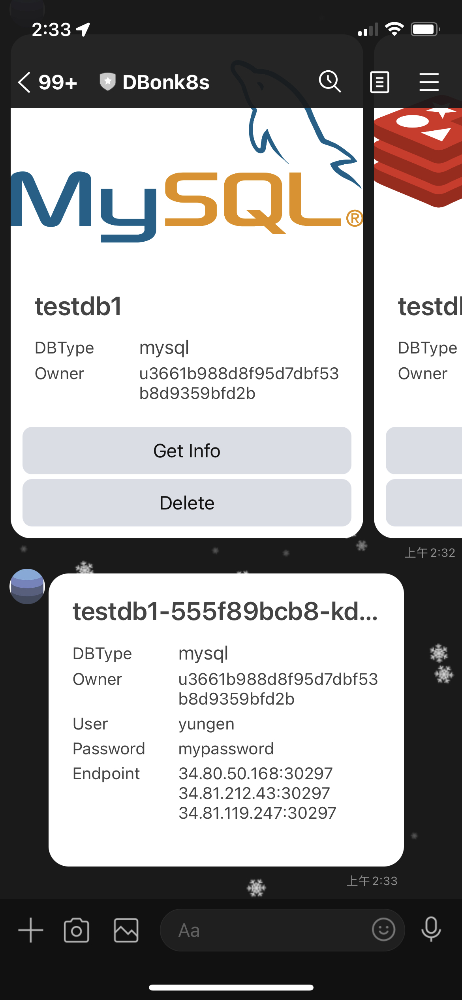

* or type `info` with database name

  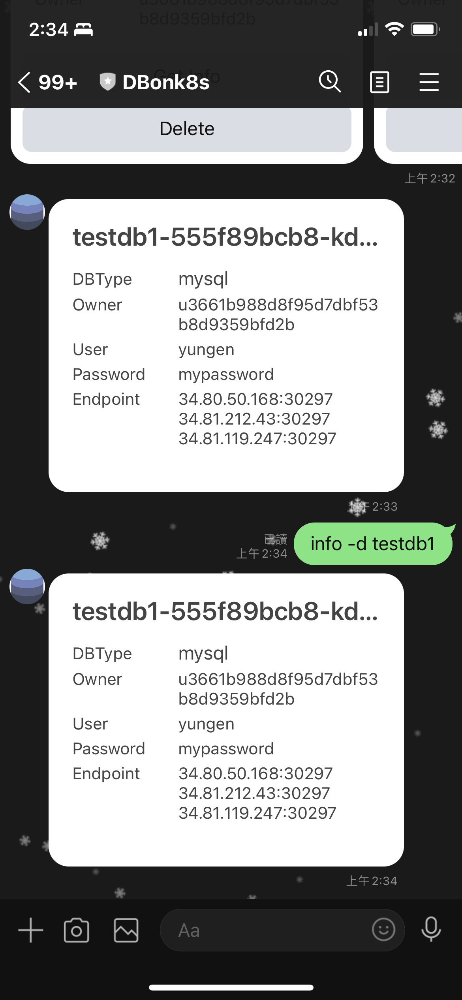

### Delete a instance

* click `Delete` button in the carousel

  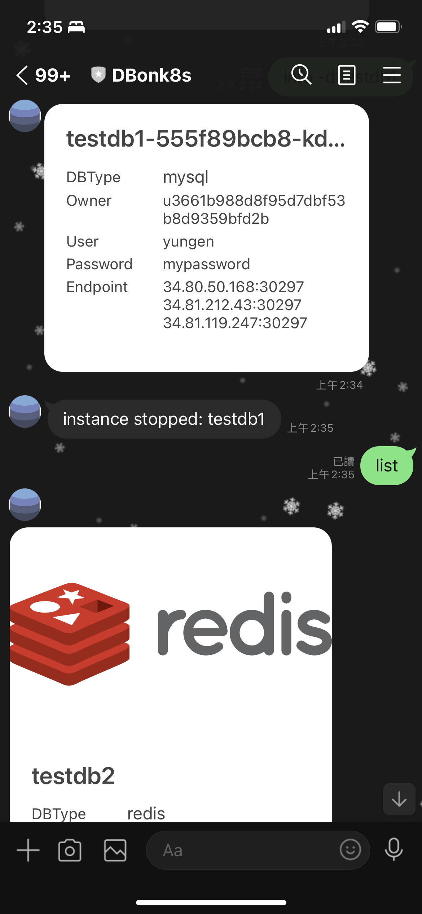

* or type `stop ` with database name

  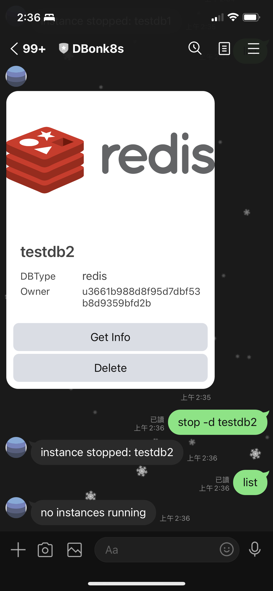

### Change user permission to admin

* type `config` with the `-t` flag followed by a token(you can change it during deploy)

  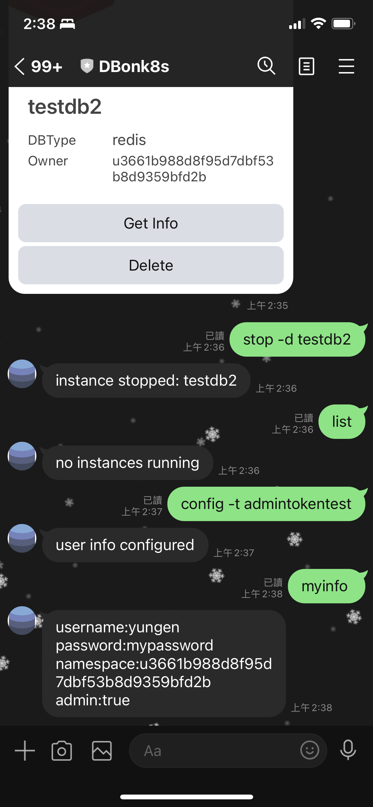

* type `list -a` to see all users instances

  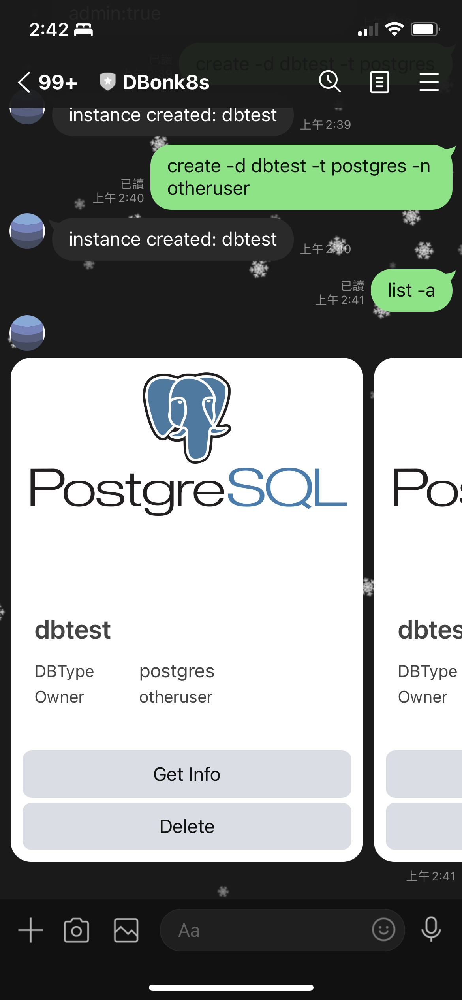

* most of the command above can use the `-n` flag to specify the user namespace

  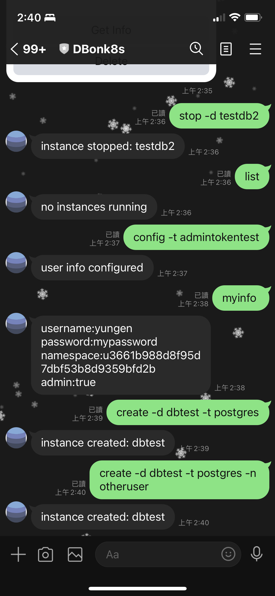


## Finite State Machine

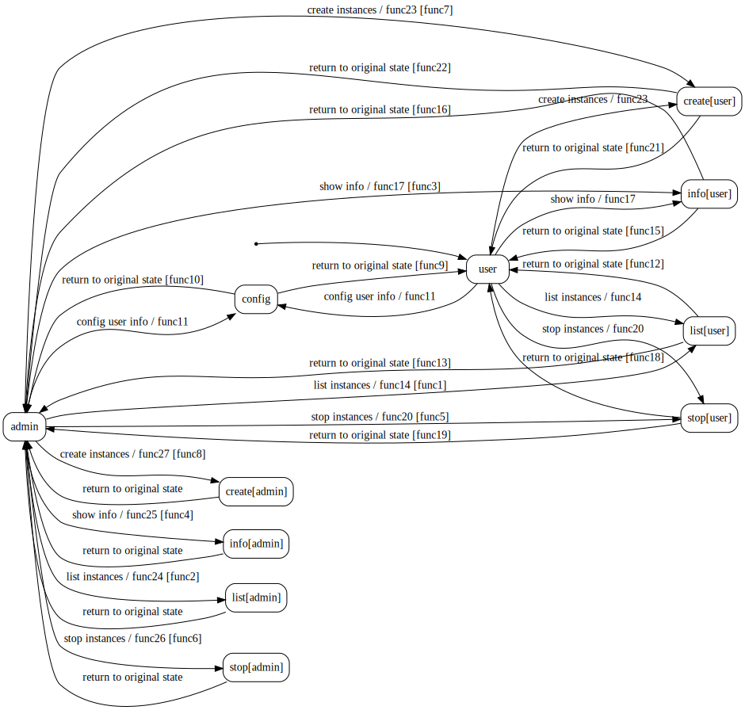